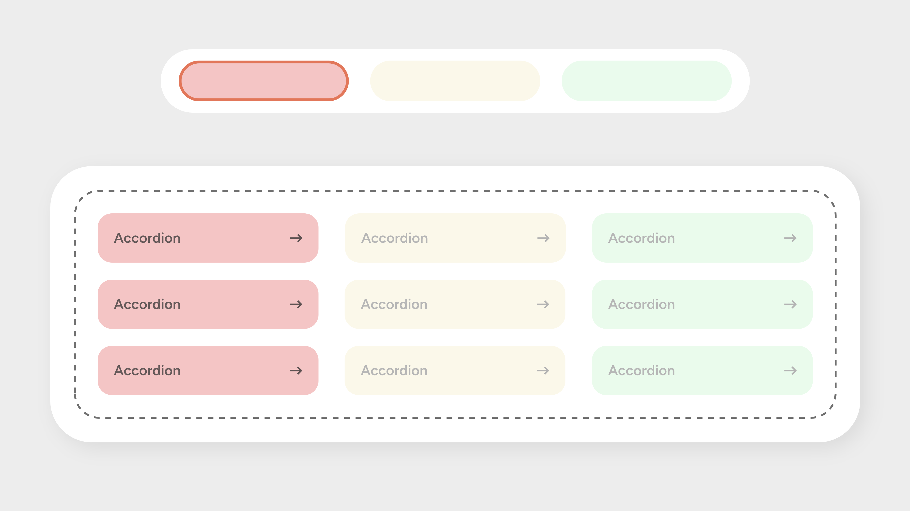

# UD Block: Accordion Filter Container

Ein WordPress-Block, der als Container für mehrere UD-Accordion-Blöcke dient und deren Anzeige dynamisch anhand von Filter-Interaktionen steuert.
Der Block erweitert bestehende Filtermechanismen um ein optionales, zusätzliches Verhalten für Accordions.


## Funktionen

- Container-Block für mehrere `ud/accordion-block`-Instanzen
- Reagiert auf externe Filter-Trigger (z. B. Buttons, Kategorien, Attribute)
- Zusätzliche Klasse `.ud-accordion-filter-active` für erweitertes Verhalten
- Geschlossene Accordions können optional klickbar werden, wenn der Filtermodus aktiv ist
- Nahtlose Erweiterung des bestehenden Filter-Systems (keine Ablösung)
- Frontend-Optimierung über `frontend.js` und `frontend.css`
- Editor-Darstellung mit Hinweisen und Container-Styling


## Screenshots

Die Abbildung zeigt den Aufbau des Accordion Filter Containers:

1. **Obere Reihe – Filterelemente**
   Externe Filter (z. B. Kategorien oder Attribute) steuern, welche Accordions sichtbar bleiben.
   Jeder Filter ist farblich hervorgehoben und repräsentiert eine aktive oder inaktive Auswahl.

2. **Grosser Container (gestrichelte Linie)**
   Dieser Bereich stellt den eigentlichen *Accordion Filter Container* dar.
   Er nimmt alle untergeordneten Accordion-Blöcke auf und reagiert auf Filter-Signale.

3. **Accordion-Gruppen (3 Spalten)**
   Farbliche Spalten repräsentieren Kategorien oder Filtergruppen.
   Jede Box ist ein einzelner `ud/accordion-block`.
   Der Container blendet nicht passende Blöcke aus oder markiert sie als klickbar, abhängig vom aktiven Filter.


## Einordnung des Systems

Der Accordion Filter Container ist ein **empfangendes System**.
Er empfängt externe Filter-Signale (z. B. Buttons, Kategorien, Attribut-Filter) und reagiert darauf.
Er sendet selbst keine Filter-Signale nach aussen und ersetzt keine bestehende Filterlogik.
Er dient ausschliesslich der Erweiterung und reagiert auf das, was das bestehende Filtersystem vorgibt.


## Technische Details

### Block-Definition

Der Block wird über `block.json` registriert und bindet eigene Editor- und Frontend-Dateien ein.

### Wesentliche Dateien

- **block.json** – Block-Definition (Name, Scripts, Styles, Meta)
- **index.js** – Editor-Logik
- **style.css** – Editor-Styles
- **frontend.js** – Filter-Erweiterung für Accordions
- **frontend.css** – Frontend-Styles für Filter-Ausblendungen und Übergänge

### Relevante CSS-Klassen

- `.accordion-block-container` – Grundcontainer
- `.ud-accordion-filter-active` – aktiviert erweitertes Klickverhalten
- `.wp-block-ud-accordion-block.is-filtered-out` – ausgeblendete Accordions

### Verhalten im Frontend

- Bei aktivem Filtermodus kann der Container automatisch alle geschlossenen Accordions mit `cursor: pointer` markieren.
- Accordions, die nicht den Filterkriterien entsprechen, werden ausgeblendet
  (Opacity 0, kein Layout-Platz, keine Pointer-Events).
- Verschachtelte Accordions bleiben funktionsfähig.

### Beispiel (vereinfachtes Markup)

```html
<div class="accordion-block-container ud-accordion-filter-active">
    <div class="wp-block-ud-accordion-block">
        …
    </div>
    <div class="wp-block-ud-accordion-block">
        …
    </div>
</div>
```

## Installation
- Plugin-Ordner in wp-content/plugins/ ablegen
- Plugin in WordPress aktivieren
- Im Site-Editor oder Block-Editor den Block Accordion Filter Container hinzufügen
- Beliebig viele UD-Accordion-Blöcke einfügen

## Anforderungen
- WordPress 6.4+
- Gutenberg / Block-Editor aktiviert
- UD Accordion Block installiert (Abhängigkeit)

## Autor
[ulrich.digital gmbh](https://ulrich.digital)

## Lizenz

GPL v2 or later
https://www.gnu.org/licenses/gpl-2.0.html
